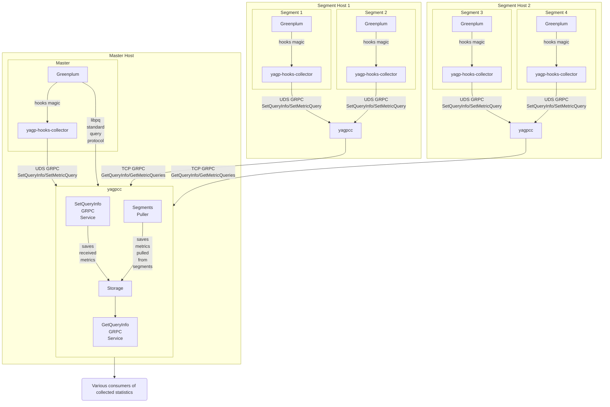

# Общая схема работы

В Greenplum клиент всегда подключается к `Master` и отправляет запросы ему.
Однако сами [запросы исполняются](https://techdocs.broadcom.com/us/en/vmware-tanzu/data-solutions/tanzu-greenplum/6/greenplum-database/admin_guide-query-topics-parallel-proc.html)
преимущественно на `Segment`-ах,
где и формируется подробная статистика их выполнения.

Для сбора статистики внутри `Greenplum` используется расширение `yagp-hooks-collector`,
которое работает как на каждом из `Segment`-ов, так и на `Master`.
Этот компонент подключается к системе хуков выполнения запроса в `Greenplum`;
и собирает необходимую телеметрию о ходе исполнения запроса.

Собранная посредством хуков статистика отправляется в локально запущенный `yagpcc`
(на каждом `Segment` и `Master` хостах).
`yagpcc` "слушает" Unix Domain Socket (UDS)
и принимает телеметрию от `yagp-hooks-collector` через protobuf `SetQueryInfo/SetMetricQuery`.

Таким образом, статистика генерируется и отправляется в локальный `yagpcc`
сразу по мере поступления данных (например, по этапам выполнения запроса),
а также после завершения запроса.

Такая реализация имеет накладные расходы и влияет на задержку обработки запросов,
так как завершение запроса возможно только после передачи статистики хуком.
Для решения такого рода проблем встроены различные таймауты
и механизмы защиты от зависания (например, обработка недоступности `yagpcc`) —
в случае таких сбоев статистика теряется, но пользовательские запросы продолжают работать.

Статистика, собранная с `Segment`-ов, по своей природе является неполной,
так как каждый `Segment` отвечает только за часть запроса.

Для получения полной картины все данные должны быть агрегированы.
Этим занимается `yagpcc`, запущенный на `Master Host`.
Концептуально это выглядит следующим образом:

1. `yagpcc` на `Master Host` подключается к `Master` через стандартный протокол `libpq`
и получает список всех `Segment Host`-ов и их адреса;
2. `yagpcc` на `Master Host` периодически опрашивает `yagpcc` на `Segment Host`-ах
через GRPC-интерфейсы `GetQueryInfo/GetMetricQueries` и получает актуальную статистику о выполнении запросов;
3. `yagpcc` на `Master Host` объединяет полученные данные с `Segment`-ов
и сохраненную локальную статистику с `Master`, формирует итоговые агрегаты и хранит их в своей памяти.

Итоговая агрегированная статистика, собранная `yagpcc` на `Master Host`,
может быть предоставлена пользователю в различных формах
(см. разделы
[Статистика в реальном времени](./real-time-stats-flow.md)
и [Историческая статистика](./historical-stats-flow.md)).

На диаграмме ниже представлена общая схема работы
на примере кластера Greenplum, состоящего из одного `Master Host`
и двух `Segment Host`, на каждом из которых расположено по 2 `Segment`.
Стрелками показан поток данных статистики,
который может отличаться от реального направления вызовов.

