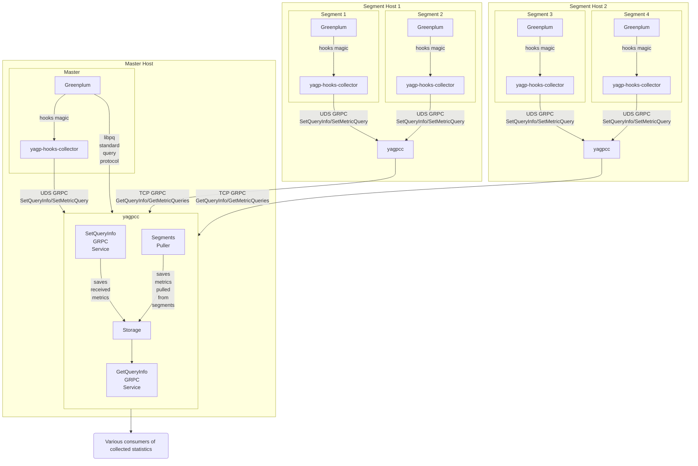

# Architecture overview

In Greenplum, the client always connects to the **Master** and sends queries to it. The queries themselves are [executed](https://techdocs.broadcom.com/us/en/vmware-tanzu/data-solutions/tanzu-greenplum/6/greenplum-database/admin_guide-query-topics-parallel-proc.html) mainly on **Segments**, where detailed execution statistics are produced.

Statistics inside Greenplum are collected by the **yagp-hooks-collector** extension, which runs on every Segment and on the Master. It plugs into Greenplum’s query execution hooks and gathers the required execution telemetry.

The statistics collected via hooks are sent to a locally running **yagpcc** instance on each Segment and Master host. yagpcc listens on a **Unix Domain Socket (UDS)** and receives telemetry from yagp-hooks-collector over protobuf (**SetQueryInfo** / **SetMetricQuery**).

So statistics are produced and sent to the local yagpcc as data arrives (e.g. by execution stage) and after the query finishes.

This design has some overhead and can add latency, because the query cannot complete until the hook has sent the statistics. To mitigate that, there are timeouts and safeguards (e.g. handling the case when yagpcc is unavailable). In those failure cases statistics may be lost, but user queries continue to run.

Statistics from Segments are inherently partial: each Segment only handles part of the query.

To get a complete picture, data must be aggregated. That is done by **yagpcc on the Master host**. In short:

1. **Master-host yagpcc** connects to the Master via the standard **libpq** protocol and gets the list of all Segment hosts and their addresses.
2. **Master-host yagpcc** periodically pulls from **yagpcc on each Segment host** over gRPC (**GetQueryInfo** / **GetMetricQueries**) and gets up-to-date execution statistics.
3. **Master-host yagpcc** merges data from Segments with local statistics from the Master, builds aggregates, and keeps them in memory.

The resulting aggregated statistics from Master-host yagpcc can be exposed to users in different ways (see [Real-time statistics](./real-time-stats-flow.md) and [Historical statistics](./historical-stats-flow.md)).

The diagram below shows this flow for a cluster with one Master host and two Segment hosts, each with two Segments. Arrows show the flow of statistics data (which may differ from the actual call direction).

