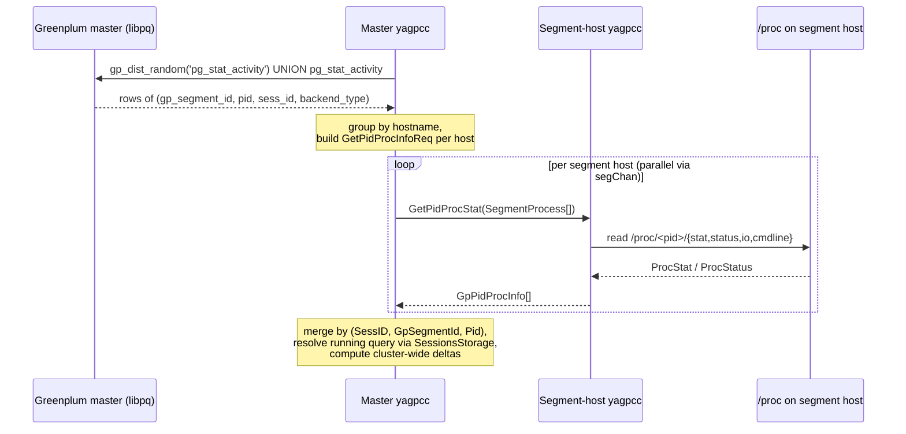

# Per-process resource statistics

This document describes how yagpcc collects per-process Linux procfs data
(`/proc/<pid>/{stat,status,io,cmdline}`) for every Greenplum / Cloudberry
backend across the cluster, attributes it to the running query and session,
and proposes an architecture for `top`-style 5 / 15 / 30-minute rolling
averages exposed on the master.

For the broader picture see [Architecture overview](./architecture.md) and
[Service architecture](./service-architecture.md). For the user-facing API
see [API description](./API.md).

---

## 1. Schema and right-now per-query / cluster flow

The data flow has three stages: PID discovery on the master, a per-host
gRPC fan-out to segment-host yagpccs, and aggregation back on the master.

### 1.1 PID discovery (master, via libpq)

The master yagpcc already maintains a background list of every Greenplum
backend (master + every segment) by polling
`gp_dist_random('pg_stat_activity') UNION ALL pg_stat_activity` from the
Greenplum master.

| Item | Location |
|------|----------|
| Cloudberry/GP6 query text | `cloudberryAllSessionsQuery` / `gp6AllSessionsQuery` in [internal/gp/stat_activity/lister.go](../internal/gp/stat_activity/lister.go) |
| Polling cadence | `WithBackgroundAllSessionsCollectionInterval` (default `60s`, see `newBackgroundAllSessions` in [internal/gp/stat_activity/lister.go](../internal/gp/stat_activity/lister.go)) |
| Cache TTL | `WithBackgroundAllSessionsCacheTTL` (default `600s`) |
| Row type | `SessionPid{GpSegmentId, Pid, SessId, BackendType}` in [internal/gp/stat_activity/models.go](../internal/gp/stat_activity/models.go) |
| Read accessor | `Lister.ListAllSessions(ctx)` |

A row of `SessionPid` carries everything we need to address a single
process from the master: its hosting segment id, its OS pid, the
Greenplum `sess_id` it belongs to, and (on Cloudberry) `backend_type`
(`client backend`, `walwriter`, …).

`gp_segment_id` is then resolved to a hostname via the existing segment
topology that the master pulls from `gp_segment_configuration` (see
[internal/master/background.go](../internal/master/background.go)).

### 1.2 Per-host fan-out (master → segment-host yagpcc, gRPC)

As a proposed follow-up wiring step, the master would group the latest
`[]SessionPid` by the segment-host that owns each `gp_segment_id` and
issue one `GetPidProcStat` call per host, re-using the existing
`segChan` puller machinery in
[internal/master/background.go](../internal/master/background.go)).
Concretely, this still needs to be implemented in the master background
processing path: `processSegment` currently calls `GetMetricQueries`, and
the planned `GetPidProcStat` request/response handling would be added
alongside that existing RPC as follow-up implementation work.

Request and response messages are already defined:

```
// api/proto/agent_segment/yagpcc_get_service.proto

service GetQueryInfo {
    rpc GetMetricQueries (GetQueriesInfoReq) returns (GetQueriesInfoResponse) {}
    rpc GetPidProcStat   (GetPidProcInfoReq) returns (GetPidProcInfoResponse) {}
}

message SegmentProcess {
    int64 gp_segment_id = 1;
    int64 sess_id       = 2;
    int64 pid           = 3;
}

message GetPidProcInfoReq {
    repeated SegmentProcess segment_process = 1;
}

message GetPidProcInfoResponse {
    repeated GpPidProcInfo pid_proc_data = 1;
}
```

`GpPidProcInfo` (defined in
[api/proto/common/yagpcc_metrics.proto](../api/proto/common/yagpcc_metrics.proto))
carries the primary key (`gp_segment_id`, `sess_id`, `pid`), the process
`cmdline`, and the parsed `ProcStat` (from `/proc/<pid>/stat`),
`ProcStatus` (from `/proc/<pid>/status`), and `ProcIO` (from
`/proc/<pid>/io`):

```
message GpPidProcInfo {
    int64       gp_segment_id = 1;
    int64       sess_id       = 2;
    int64       pid           = 3;
    string      cmdline       = 4;
    ProcStat    proc_stat     = 5;
    ProcStatus  proc_status   = 6;
    ProcIO      proc_io       = 7;
}

message ProcIO {
    int64 rchar                  = 1;  // bytes read via read-like syscalls
    int64 wchar                  = 2;  // bytes written via write-like syscalls
    int64 syscr                  = 3;  // read syscall count
    int64 syscw                  = 4;  // write syscall count
    int64 read_bytes             = 5;  // bytes fetched from storage
    int64 write_bytes            = 6;  // bytes sent to storage
    int64 cancelled_write_bytes  = 7;  // writes never persisted
}
```

All `ProcIO` fields are cumulative kernel counters, so the master
computes per-tick **deltas** to derive `read_bytes/sec`,
`write_bytes/sec`, etc. The numeric fields in `ProcStat`, `ProcStatus`,
and `ProcIO` are intentionally **signed** (`int32` / `int64` rather than
the `uint*` types used by `prometheus/procfs`) so the same layout can
also carry deltas (where a negative value is a legitimate signal of
counter reset / PID reuse) without needing a parallel signed-delta
schema. Counter values themselves never exceed `2^63` for any realistic
process lifetime, so the conversion is lossless.

### 1.3 Segment side (stateless)

The segment-host yagpcc keeps **no local state** for proc-stats. On every
`GetPidProcStat` call it:

1. Iterates the `SegmentProcess` entries from the request.
2. For each `(gp_segment_id, sess_id, pid)` reads
   `/proc/<pid>/stat`, `/proc/<pid>/status`, `/proc/<pid>/io`,
   `/proc/<pid>/cmdline`.
3. Skips entries where the process has already exited (`ENOENT`) so that
   the master can detect process disappearance from the missing key
   alone.
4. Returns the assembled `[]GpPidProcInfo`.

Note that `/proc/<pid>/io` counters (`read_bytes`, `write_bytes`,
`rchar`, `wchar`, `syscr`, `syscw`, `cancelled_write_bytes`) are also
surfaced through the `SystemStat` portion of the hook-collected
`GPMetrics` documented in
[API.md → SystemStat (procfs)](./API.md#systemstat-procfs). That path
delivers data only when the `yagp-hooks-collector` extension is loaded
in Greenplum and only for queries it can hook. `GetPidProcStat` is the
authoritative path for per-tick procfs sampling and works for every
backend in `pg_stat_activity` (including system processes that
`yagp-hooks-collector` never sees), so the master uses `ProcIO` raw
counters from this RPC and computes deltas itself.

### 1.4 Master aggregation (right-now per query, cluster-wide)

For every `GpPidProcInfo` returned, the master uses
`SessionsStorage` ([internal/gp/sessions.go](../internal/gp/sessions.go))
to look up the `SessionInfo` keyed by `SessID` (taking the new
`SessID == -1 → -pid` translation into account when the backend is a
Cloudberry system process), and, if the session has a running query,
attributes the sample to that `(SessID, ccnt)`.

For each running query the master sums across **all** the segments
that returned a `GpPidProcInfo`:

| Cluster-wide metric for the running query | Computation |
|-------------------------------------------|-------------|
| CPU seconds in the last interval | `Σ_segments Δ(utime + stime) / clk_tck` |
| Bytes read in the last interval | `Σ_segments Δ(read_bytes)` |
| Bytes written in the last interval | `Σ_segments Δ(write_bytes)` |
| RSS (gauge) | `Σ_segments ProcStatus.vm_rss` |
| Peak VmSize (gauge) | `max_segments ProcStatus.vm_peak` |

`clk_tck` is `sysconf(_SC_CLK_TCK)` on the master host (typically `100`).
This number is exposed alongside the existing `SessionState.QueryMetrics`
so consumers calling `GetGPQuery(query_key)` see the live cluster-wide
CPU / RSS / IO of the running query in addition to the hook-collected
`GPMetrics`.

### 1.5 End-to-end sequence



---

## 2. Architecture for 5 / 15 / 30-minute top-style averages

The `top` utility shows three load averages with time constants of 1, 5
and 15 minutes. We expose the same idea at two grains:

- **Per-session** — every `SessionInfo` carries 5 / 15 / 30-minute
  rolling averages of CPU rate, RSS, and IO rates, summed across the
  session's processes on every segment.
- **Cluster-wide rollup** — a single `ProcAvg` instance for the whole
  cluster, reported in a new `GetClusterTop` RPC.

All rolling state lives **only on the master**. Segments stay stateless
and just answer `GetPidProcStat` each tick.

### 2.1 Algorithm: top-style EMA, decoupled from sample period

For each metric stream `M(t)` (CPU rate in seconds-per-second,
instantaneous RSS bytes, IO bytes/sec) we keep three exponential moving
averages with time constants `τ ∈ {5min, 15min, 30min}`. On every sample
taken at time `t` with elapsed `Δt = t - t_prev`:

```
α   = 1 - exp(-Δt / τ)
EMA = EMA*(1 - α) + sample*α
```

This is the same recurrence the kernel uses for `loadavg`, but written
for variable `Δt`, so it is robust to:

- missed ticks (network blip, segment restart, segment unreachable);
- a changing `segment_pull_rate_sec` between ticks;
- long pauses caused by GC / scheduling on the master.

If `Δt → 0` then `α → 0` and the EMA does not move; if `Δt ≫ τ` then
`α → 1` and the EMA snaps to the sample. Both are the desired behaviour.

#### Sample inputs

For each session sample, with the per-segment delta state from the
previous tick:

| Sample | Definition |
|--------|------------|
| `cpu_rate` | `(Σ_segments Δ(utime + stime) ticks) / clk_tck / Δt` (units: cores) |
| `rss` | `Σ_segments ProcStatus.vm_rss` (units: bytes; instantaneous gauge — averaged directly) |
| `io_read_rate` | `Σ_segments Δ(read_bytes) / Δt` |
| `io_write_rate` | `Σ_segments Δ(write_bytes) / Δt` |
| `chr_read_rate` | `Σ_segments Δ(rchar) / Δt` |
| `chr_write_rate` | `Σ_segments Δ(wchar) / Δt` |

Per-segment delta state is keyed by `(SessID, GpSegmentId, Pid)` and
includes `proc_stat.starttime`, so PID reuse on a segment is detected
by a `starttime` mismatch and produces a delta-reset (no spike).

### 2.2 Storage on the master (sketch)

Sketch only — actual implementation is a follow-up plan, not part of
this doc.

```go
// extension of internal/gp/sessions.go SessionInfo
type ProcAvg struct {
    Cpu5,  Cpu15,  Cpu30  float64 // CPU cores, cluster-wide for this session
    Rss5,  Rss15,  Rss30  float64 // bytes
    IoR5,  IoR15,  IoR30  float64 // bytes/sec read   (read_bytes)
    IoW5,  IoW15,  IoW30  float64 // bytes/sec written (write_bytes)
    LastSampleAt time.Time
}

// per-process delta state used to derive samples between ticks
type pidSample struct {
    StartTime  uint64    // proc_stat.starttime (clock ticks since boot)
    Utime      uint32
    Stime      uint32
    ReadBytes  uint64
    WriteBytes uint64
    Rchar      uint64
    Wchar      uint64
    SampledAt  time.Time
}

type procKey struct {
    SessID      int
    GpSegmentId int
    Pid         int
}

type pidSampleStore map[procKey]pidSample
```

The cluster-wide `ProcAvg` is updated by **summing the per-tick session
samples first and then applying the EMA step** (sum-then-smooth, not
smooth-then-sum). Re-smoothing already-smoothed per-session curves
would lag the true cluster total by an extra `τ` and is wrong.

### 2.3 Lifecycle / eviction

- **Per-session `ProcAvg`** is dropped together with its `SessionInfo`
  in the `clearDeletedSessions` branch of
  `RefreshSessionList` ([internal/gp/sessions.go](../internal/gp/sessions.go)).
  No separate GC.
- **Per-PID delta state** (`pidSampleStore`) is GC'd on each tick: any
  `procKey` not present in the latest `[]SessionPid` is dropped. A PID
  that disappears mid-window simply stops contributing to its session
  EMA — the existing decay carries the value down towards zero over
  ≈ 3·τ, exactly like `top`.
- **PID reuse** is detected by `proc_stat.starttime`: if the new sample
  has a different `starttime` than the cached one for the same
  `(seg, pid)`, the sample is treated as a fresh start (cache the new
  baseline, emit no delta this tick).

### 2.4 Proposed gRPC surface

These are **proposals** — not implemented as part of this doc.

- Extend `SessionState` in
  [api/proto/common/yagpcc_session.proto](../api/proto/common/yagpcc_session.proto)
  with an optional field:

  ```
  ProcAvg proc_avg = N;  // master-only, populated on master role
  ```

  and the matching message (probably best placed in
  `api/proto/common/yagpcc_metrics.proto` next to `GpPidProcInfo`):

  ```
  message ProcAvg {
      double cpu_5,  cpu_15,  cpu_30;
      double rss_5,  rss_15,  rss_30;
      double io_r_5, io_r_15, io_r_30;
      double io_w_5, io_w_15, io_w_30;
      google.protobuf.Timestamp last_sample_at;
  }
  ```

- Add a master-side `GetClusterTop` RPC in
  [api/proto/agent_master/yagpcc_get_service.proto](../api/proto/agent_master/yagpcc_get_service.proto):

  ```
  rpc GetClusterTop (GetClusterTopReq) returns (GetClusterTopResponse) {}

  message GetClusterTopReq {
      int64       limit  = 1;            // top-N sessions
      SessionField sort  = 2;            // e.g. TOTAL_USERTIMESECONDS, or a new CLUSTER_TOP_* enum
  }
  message GetClusterTopResponse {
      ProcAvg cluster                 = 1;  // cluster-wide rollup
      repeated SessionState sessions  = 2;  // top-N by sort key, with proc_avg populated
  }
  ```

The existing `GetGPSessions` / `GetGPQuery` pathways remain unchanged;
they just gain a populated `proc_avg` on each `SessionState`.

### 2.5 Configuration

Existing knobs that govern sample cadence:

| Knob | Default | Defined in |
|------|---------|------------|
| `segment_pull_rate_sec` | per yagpcc.yaml | [cmd/server/yagpcc_master.yaml](../cmd/server/yagpcc_master.yaml), [internal/config/config.go](../internal/config/config.go) |
| `segment_pull_threads`  | per yagpcc.yaml | same |
| `WithBackgroundAllSessionsCollectionInterval` | `60s` | [internal/gp/stat_activity/lister.go](../internal/gp/stat_activity/lister.go) |
| `WithBackgroundAllSessionsCacheTTL` | `600s` | same |

New knobs to add when implementing the architecture:

| Knob | Default | Purpose |
|------|---------|---------|
| `proc_pull_rate_sec` | equal to `segment_pull_rate_sec` | Cadence for `GetPidProcStat`. Independent so the new pull doesn't have to share the fan-out cadence of `GetMetricQueries`. |
| `proc_avg_taus` | `[5m, 15m, 30m]` | Time constants of the three EMAs. Configurable so operators can tune to longer windows on lightly-used clusters. |

### 2.6 Worked numeric example

Setup:

- One session running on two segments, CPU-bound.
- `clk_tck = 100`.
- Master ticks every `Δt = 5s`.
- `τ_5 = 300s`, `τ_15 = 900s`, `τ_30 = 1800s`.
- Initial EMAs are zero; per-segment delta state is empty.

Pre-computed `α`:

| τ | `α = 1 - exp(-5/τ)` |
|---|---------------------|
| 300s  | `0.01653` |
| 900s  | `0.00554` |
| 1800s | `0.00277` |

#### Tick t = 0 (baseline)

The master records the raw counters (`utime`, `stime`, `read_bytes`, …,
`starttime`) for each `(seg, pid)`. No deltas are emitted yet because
there is no previous sample. EMAs stay at `0`.

#### Tick t = 5s

Per-segment deltas (in clock ticks):

| Segment | `Δ(utime + stime)` | wall | utilization |
|---------|--------------------|------|-------------|
| seg-0   | 480 ticks → 4.80s  | 5s   | 96% of 1 core |
| seg-1   | 500 ticks → 5.00s  | 5s   | 100% of 1 core |

Cluster sample:

```
cpu_rate = (480 + 500) / 100 / 5 = 1.96 cores
```

EMA update for the session, starting from `EMA = 0`:

| τ | `(1 - α)` | `EMA·(1-α)` | `α·sample` | new EMA |
|---|-----------|-------------|------------|---------|
| 300s  | 0.98347 | 0.0000 | 0.03240 | **0.03240** |
| 900s  | 0.99446 | 0.0000 | 0.01086 | **0.01086** |
| 1800s | 0.99723 | 0.0000 | 0.00543 | **0.00543** |

#### Tick t = 10s (same load)

Same `cpu_rate = 1.96`. EMAs from the previous tick:

| τ | previous EMA | `EMA·(1-α)` | `α·sample` | new EMA |
|---|--------------|-------------|------------|---------|
| 300s  | 0.03240 | 0.03186 | 0.03240 | **0.06426** |
| 900s  | 0.01086 | 0.01080 | 0.01086 | **0.02166** |
| 1800s | 0.00543 | 0.00541 | 0.00543 | **0.01084** |

After many ticks at constant load each EMA converges to the sample
value `1.96` cores; the 5-minute EMA reaches that asymptote first, the
30-minute EMA last (≈ 3·τ to within a few percent).

#### Cluster-wide rollup

If three sessions are each producing the same `cpu_rate = 1.96`, the
cluster sample at every tick is `5.88 cores`. After the first
post-baseline tick:

| τ | cluster `EMA = α·5.88` |
|---|------------------------|
| 300s  | **0.0972** |
| 900s  | **0.0326** |
| 1800s | **0.0163** |

Note this is computed from the **summed** per-session samples
(sum-then-smooth), not from `Σ EMA_session`.

#### Process disappears mid-window

If the running query finishes between tick `T` and tick `T + 1`, then
at tick `T + 1`:

- The PID is missing from `[]SessionPid` returned by
  `Lister.ListAllSessions`. The master never asks for it via
  `GetPidProcStat`, so it gets no `GpPidProcInfo`.
- Its `procKey` is removed from `pidSampleStore`.
- The session sample for this tick is `0` (no live processes
  contributing).
- The EMA decays as `EMA_{T+1} = EMA_T · (1 - α)` per tick.
  Half-life ≈ `τ · ln(2)` (≈ `3.5min` for `τ = 5min`,
  `≈ 10.4min` for `τ = 15min`, `≈ 20.8min` for `τ = 30min`),
  matching `top` semantics.

---

## 3. Out of scope

- Implementing the segment-side procfs reader and
  `GetQueryInfoServer.GetPidProcStat`.
- Implementing the master-side `pidSampleStore` and EMA aggregator.
- Adding the `ProcAvg` proto message, the `proc_avg` field on
  `SessionState`, and the `GetClusterTop` RPC.
- Wiring `proc_pull_rate_sec` and `proc_avg_taus` config.

These are tracked as follow-up implementation plans.
